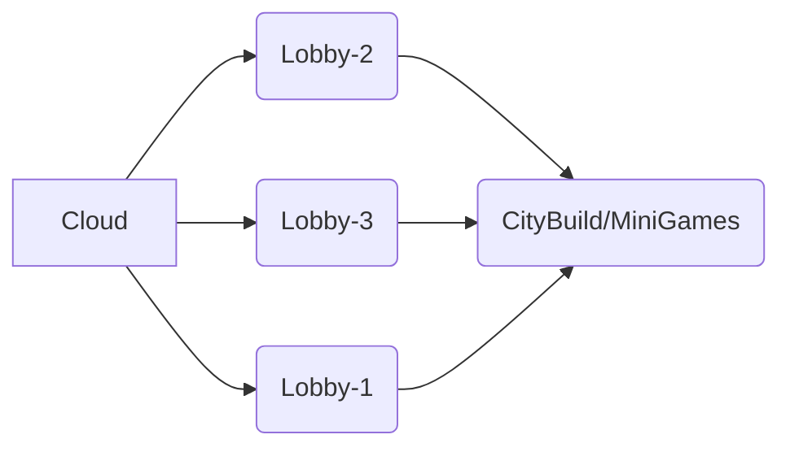

# MrExpertTV

Moinsen! Hier gibt es Minecraft Content rund um Minecraft Servern... 

Discord: @mrexperttv 

Also Like und lasst ein Aboooooo da!

# Config.yml

Hier sind die Config's aus meinen Videos:

 1. [Tab - config.yml](https://github.com/MrExpertTV/Youtube/tree/main/TAB%20Config)
 2.  

## Eigene Plugins

Hier stehen meine eigene Plugins sowie auch mache Skrips!

## Mein Server

Mein Server: 
CROSSPLAY 

DIESER SERVER IST NOCH IM BAU !

> **IP**: play.tehrion.de
> 
> **PORT**: 25565 

Webseite zum Bewerben: https://tehrion.de/bewerbung

## Wie ist ein Server Netzwerk Aufgebaut?

**Netwerk**: 
Um ein Netzwerk Aufzubauen, benötigst du paar Grundlegende Sachen.

Und zwar brauchst du einen V-Server oder ein Windows Server um mehre Server zu erstellen und zu verbinden!

Wenn du das hast und alles Installiert hast, kannst du dich Entscheiden ob du alles Manuelle machen willst oder mit einer Cloud 

*Manuelle-ART*: 

Diese Variante kosten Zeit.... Du musst für jeden Server eine eigenen Ordner erstellen so viel die nötigen Plugins (wie zum Beispiel: "start.sh" Datei oder die "spigot.jar" Datei)

 - [BungeeCord](https://www.spigotmc.org/wiki/bungeecord/)
 - [Waterfall](https://papermc.io/software/waterfall)
 
 *Cloud*:

Mit diese Variante geht es schnell... Du musst nur die Cloud aufsetzen und ein paar dinge einstellen! 

Und danach dauert ein Server zu erstellen nicht weniger als 1 Minute! 
 
 - [SimpleCloud](https://simplecloud.app)
 - [CloudNET](https://cloudnetservice.eu/de/docs/3.4/)

